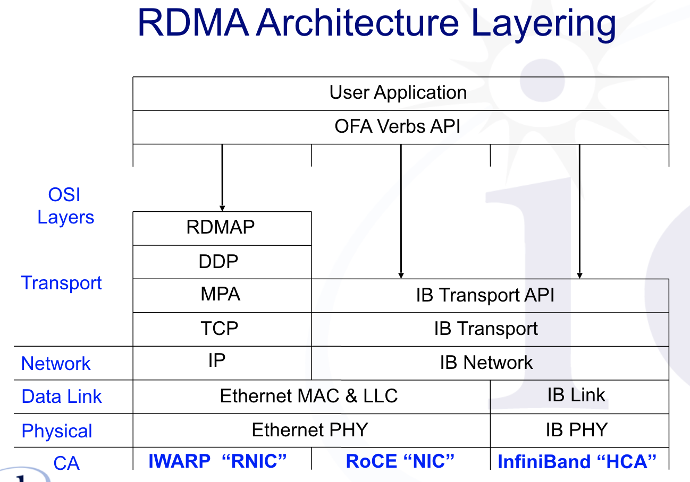
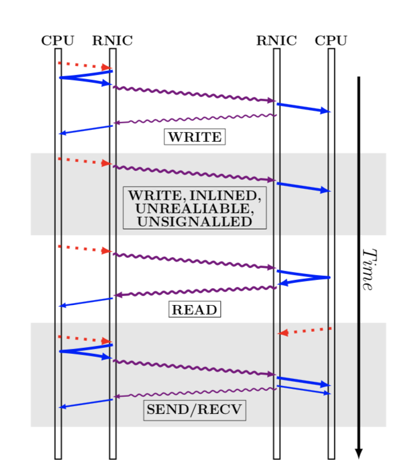

# Architecture Lab3: An Intro. to RDMA

*Author: Chengzu Ou (14302010037)*
## Abstract

In this report, we will going to take a look at an interesting technology called RDMA. We will explain what it is and why we should consider using it. We will also cover some basic concepts in this field. At last, we will show a possible application of RDMA in key-value services.

## What is RDMA?
RDMA, remote direct memory access, is a direct memory access from the memory of one computer into that of another without involving either one’s operating system.

The term “RDMA” is usually used to refer to networking technologies that have a software interface with Remote DMA.

Just as the name says, remote DMA is DMA on a remote system. The adapter on system 1 can send a message to the adapter on system 2 that causes the adapter on system 2 to DMA data to or from system 2’s memory.

The messages come in two main types:
- **RDMA Write:** includes an address and data to put at that address, and causes the adapter that receives it to put the supplied data at the specified address
- **RDMA Read:** includes an address and a length, and causes the adapter that receives it to generate a reply that sends back the data at the address requested

These messages are “one-sided” in the sense that they will be processed by the adapter that receive them without involving the CPU on the system that receives the messages.

RDMA adapters give fine-grained control over what remote systems are allowed to do. Things like protection domains and memory keys allow you to control connection-by-connection and byte-by-byte with separate read and write permissions. So there is no need to worry about the securities.

## Basic Concepts
To have a better understanding of RDMA, let’s take a look at some basic concepts behind it.

### Queue pair
To draw an analogy from everyday mail service, queue pair (QP) defines the address of the communication endpoints, or equivalently, sockets in traditional socket based programming. Each communication endpoint needs to create a QP in order to talk to each other.

### Verbs
In RDMA based programming, verb is a term that defines the types of communication operations. There are two different communication primitives: channel semantics (send/receive) and memory semantics (read/write). If we only consider how data is delivered to the other end, channel semantics involves both communication endpoints: the receiver needs to pre-post receives and the sender posts sends; while memory semantics only involves one side of the communication endpoint: the sender can write the data directly to the receiver's memory region, or the receiver can read from the target's memory region without notifying the target.

Generally speaking, memory semantics has less overhead compared to channel semantics and thus has higher raw performance; On the other hand, channel semantics involves less programming effort.

## Why it is Useful?
RDMA has been widely used in high performance computing (HPC), and now becomes more popular in today's datacenter environment. But why it is useful?

To see why RDMA is useful, you can think of RDMA operations as “direct placement” operations: data comes along with information about where it’s supposed to go. For example, there is a spec for NFS/RDMA, and it’s pretty easy to see why RDMA is nice for NFS. The NFS/RDMA server can service requests in whatever order it wants and return responses via RDMA as they become available; by using direct placement, the responses can go right into the buffers where the client wants them, without requiring the NFS client to do any copying of data.

RDMA supports zero-copy networking by enabling the network adapter to transfer data directly to or from application memory, eliminating the need to copy data between application memory and the data buffers in the operating system. Such transfers require no work to be done by CPUs, caches, or context switches, and transfers continue in parallel with other system operations. When an application performs an RDMA Read or Write request, the application data is delivered directly to the network, reducing latency and enabling fast message transfer.

## An Application of RDMA in K-V Services
There are already many trying to develop an application using RDMA’s good features. One of the attempts is to use RDMA to support remote hash-table access.

DRAM-based key-value stores and caches are widespread in large- scale Internet services. They are used both as primary stores, and as caches in front of backend databases. At their most basic level, these systems export a traditional `GET`/`PUT`/`DELETE` interface. Internally, they use a variety of data structures to provide fast, memory-efficient access to their underlying data.

Recent in-memory object stores have used both tree and hash table-based designs. Hash table design has a long and rich history, and the particular flavor one chooses depends largely on the desired optimization goals.

*Pilaf* is a key-value store that aims for high performance and low CPU use. For `GET`s, clients access a cuckoo hash table at the server using `READ`s, which requires 2.6 round trips on average for single `GET` request. For `PUT`s, clients send their requests to the server using a `SEND` message.

*FaRM* is a more general-purpose distributed computing platform that exposes memory of a cluster of machines as a shared address space. It’s design provides two components for comparison. First is its key-value store design, which uses a variant of *Hopscotch hashing* to create a locality-aware hash table. For `GET`s, clients `READ` several consecutive Hopscotch slots, one of which contains the key with high probability. Another `READ` is required to fetch the value if it is not stored inside the hash table. For `PUT`s, clients `WRITE` their request to a circular buffer in the server’s memory. The server polls this buffer to detect new requests.

## Conclusion
We took a brief introduction to RDMA and showed a possible application of it. RDMA is really an exciting technology in boosting communication within clustering. There are also some critiques of it, mostly related to the the scalability. However it is still a successful technology from some of the programming paradigms.
